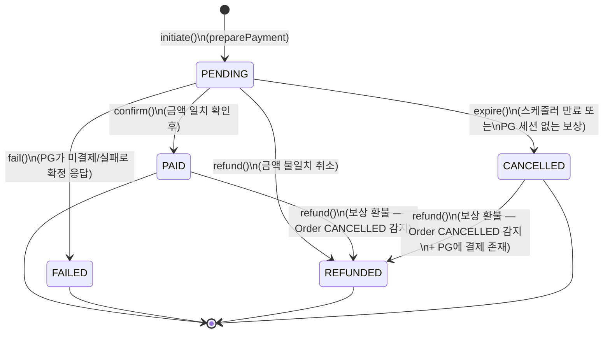
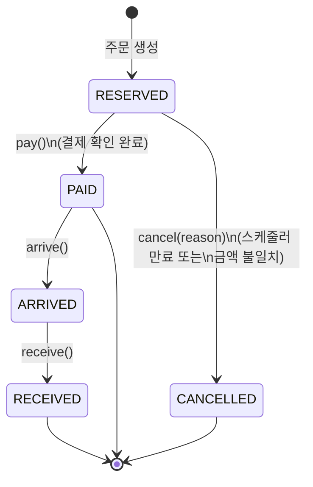
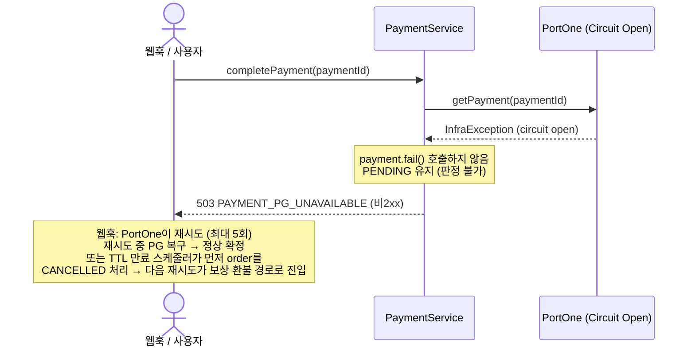

# 결제·주문·PG 상태 전이 분석 — PR #140 구현 기록

> PR #139 구현 과정에서 Payment, Order, PortOne(PG) 3자의 상태가 맞물리는 복잡한 분기를 처리했다.  
> 이 문서는 최종 상태 머신 구조, 시나리오별 흐름, 그리고 구현 중 놓쳐서 추가한 로직을 기록한다.

---

## 1. 상태 머신

### Payment 상태 전이



**상태 의미**

| 상태 | 의미 |
|------|------|
| `PENDING` | 결제 준비 완료, PG 처리 대기 중 |
| `PAID` | PG 결제 확인 완료 |
| `FAILED` | PG가 미결제/실패로 **확정 응답**한 상태. 터미널 — 재시도 불가. 돈이 빠져나가지 않았으므로 보상 환불 대상 아님 (#207) |
| `CANCELLED` | PG 세션이 없어 환불 불필요한 만료 처리 |
| `REFUNDED` | PG 취소 완료 후 DB 반영 |

---

### Order 상태 전이



> `Order.cancel()`은 `RESERVED` 상태에서만 허용된다.  
> `PAID` 이후 취소 경로는 이 PR 범위 밖이다.

---

## 2. 시나리오별 흐름

### 시나리오 A — 정상 결제

```mermaid
sequenceDiagram
    actor User
    participant API as PaymentService
    participant PG as PortOne

    User->>API: preparePayment(userId, orderId)
    Note over API: Order.RESERVED 확인<br/>소유권 확인<br/>중복 PENDING/PAID 확인
    API-->>User: paymentId

    User->>PG: 카드 정보 입력 (브라우저)
    PG-->>User: 결제 완료 응답

    User->>API: completePayment(paymentId)
    API->>PG: getPayment(paymentId)
    PG-->>API: status=PAID, amount=N

    Note over API: 금액 일치 확인
    API: order.pay() + payment.confirm()
    API-->>User: VerifyPaymentResponse
```

---

### 시나리오 B — 금액 불일치

```mermaid
sequenceDiagram
    actor User
    participant API as PaymentService
    participant PG as PortOne

    User->>API: completePayment(paymentId)
    API->>PG: getPayment(paymentId)
    PG-->>API: status=PAID, amount=M (≠ N)

    Note over API: 금액 불일치 감지
    API->>PG: cancelPayment(paymentId, "금액 불일치")
    PG-->>API: 취소 완료

    API: payment.refund() + order.cancel()
    API-->>User: 400 PAYMENT_AMOUNT_MISMATCH
```

---

### 시나리오 C — 스케줄러 만료

```mermaid
sequenceDiagram
    participant Scheduler as PaymentExpiryScheduler
    participant Svc as PaymentExpireService
    participant DB

    loop 60초 주기
        Scheduler->>DB: findExpiredPendingPaymentIds\n(PENDING + RESERVED + createdAt < threshold)
        DB-->>Scheduler: [paymentId, ...]

        loop 각 paymentId
            Scheduler->>Svc: cancelExpiredPayment(id, threshold)
            Note over Svc: 재확인: PENDING? RESERVED? 임계값 이내?
            Svc: payment.expire() + order.cancel()
            Svc: product.restoreStock()
        end
    end
```

> **스케줄러는 PG를 호출하지 않는다.**  
> PENDING Payment는 PG에 카드 정보가 제출되지 않은 상태이므로 취소할 PG 세션이 없다.

---

### 시나리오 D — 보상 환불 (핵심 복잡 시나리오)

스케줄러가 먼저 만료 처리한 뒤, 사용자의 webhook이 뒤늦게 도착하는 경우.

```mermaid
sequenceDiagram
    participant PG as PortOne
    participant Webhook as PaymentController
    participant Svc as PaymentService

    Note over PG: 스케줄러 만료 직전<br/>사용자가 카드 정보를 제출

    PG->>Webhook: webhook (Transaction.Paid)

    Webhook->>Svc: completePayment(paymentId)

    Note over Svc: order.status == CANCELLED 감지

    alt payment.status == REFUNDED
        Svc-->>Webhook: ORDER_EXPIRED_REFUNDED (멱등)
    else payment.status == PENDING or CANCELLED
        Svc->>PG: cancelPayment("주문 만료로 인한 자동 환불")

        alt PG 취소 성공 (pgCancelled = true)
            Svc: payment.refund()
        else PG에 결제 없음 (pgCancelled = false)
            Note over Svc: payment.status == PENDING이면
            Svc: payment.expire()
        end

        Svc-->>Webhook: throw ORDER_EXPIRED_REFUNDED
    end

    Webhook-->>PG: HTTP 200 (재시도 방지)
```

---

### 시나리오 E — PG 장애 (Circuit Breaker) — #207 수정 반영



> **판정 불가 vs 판정 완료**
> - 조회 실패(`InfraException`)·빈 응답 → **판정 불가**. `PENDING` 유지, 비2xx로 재시도 유도.
> - PG가 `PAID`가 아니라고 확정 응답 → **판정 완료**. `payment.fail()` → `FAILED`. 웹훅 핸들러는 `PAYMENT_NOT_COMPLETED`를 터미널로 보고 200 반환하여 재시도를 멈춘다.
>
> **cancelPayment의 circuit open**은 다르다.
> `cancelPaymentFallback`이 `InfraException`을 throw → `executePGCancel`에서 catch되지 않음 → 전파 → 트랜잭션 롤백 → payment 상태 변경 없음.

---

## 3. 구현 중 놓쳐서 추가한 로직

### (1) CANCELLED Payment의 보상 환불 경로 차단 버그

**증상**: 스케줄러가 Payment를 `CANCELLED`로 만료한 뒤 webhook이 도착하면, `completePayment` 진입 시 상태 가드에서 `PAYMENT_INVALID_STATE_TRANSITION`을 던지며 보상 환불 경로에 도달하지 못했다.

**원인**: Order CANCELLED 감지 이전에 있던 `payment.status != PENDING` 가드가 CANCELLED 상태도 차단하고 있었다.

**수정**: Order CANCELLED 분기를 먼저 확인하고, `PENDING | CANCELLED`만 보상 환불 허용 / `REFUNDED`는 멱등 반환 / 나머지는 INVALID_STATE_TRANSITION으로 명시적 분기.

```java
// 수정 전 — CANCELLED Payment가 보상 환불에 도달 불가
if (payment.getStatus() != PaymentStatus.PENDING) {
    throw new BusinessException(PaymentErrorCode.PAYMENT_INVALID_STATE_TRANSITION);
}
// ... order CANCELLED 체크

// 수정 후 — Order CANCELLED를 먼저 확인
if (order.getStatus() == OrderStatus.CANCELLED) {
    if (payment.getStatus() == PaymentStatus.REFUNDED) { /* 멱등 */ }
    if (payment.getStatus() != PENDING && payment.getStatus() != CANCELLED) { /* 차단 */ }
    // 보상 환불 처리
}
```

---

### (2) Circuit Breaker null 반환을 성공으로 처리

**증상**: `cancelPaymentFallback`이 `null`을 반환할 때, `executePGCancel`이 `null`을 정상 응답으로 간주하여 `payment.refund()`까지 진행되었다. PG 취소 없이 DB만 REFUNDED가 되는 데이터 불일치.

**수정**: `cancelPaymentFallback`을 `null` 반환 → `InfraException(PAYMENT_PG_UNAVAILABLE)` throw로 변경. `executePGCancel`은 `BusinessException`만 처리하므로 `InfraException`은 그대로 전파되어 트랜잭션이 롤백되고 결제 상태가 변경되지 않는다.

---

### (3) PAYMENT_NOT_FOUND 시 PENDING Payment 고아

**증상**: `executePGCancel`이 `false`(PG에 결제 세션 없음)를 반환할 때, Payment가 `PENDING` 상태 그대로 방치되었다. Order는 `CANCELLED`이고, 스케줄러는 `order.status == RESERVED`인 Payment만 스캔하므로 이 Payment는 어떤 경로로도 정리되지 않았다.

**타이밍**: 사용자가 PG에 카드 정보를 제출하기 전에 스케줄러가 만료 처리를 완료한 경우.

**수정**: `pgCancelled == false && payment.status == PENDING`일 때 `payment.expire()` 호출.

```java
boolean pgCancelled = executePGCancel(paymentId, "주문 만료로 인한 자동 환불");
if (pgCancelled) {
    payment.refund();
} else if (payment.getStatus() == PaymentStatus.PENDING) {
    payment.expire();  // ← 추가: PG 세션 없는 PENDING은 CANCELLED로 정리
}
```

---

### (4) Webhook 무한 재시도

**증상**: PortOne은 webhook 응답이 2xx가 아니면 재시도한다. 첫 번째 webhook 처리 후 Payment가 `REFUNDED`가 되면, 두 번째 webhook에서 `completePayment`가 `PAYMENT_INVALID_STATE_TRANSITION(409)`를 던져 PortOne이 무한 재시도에 빠졌다.

**수정 1**: `payment.status == REFUNDED` 진입 시 `ORDER_EXPIRED_REFUNDED`를 throw하도록 변경.  
**수정 2**: webhook 핸들러에서 `ORDER_EXPIRED_REFUNDED`를 catch하여 HTTP 200 반환 → PortOne 재시도 루프 차단.

```java
// PaymentController
} catch (BusinessException e) {
    if (e.getErrorCode() == PaymentErrorCode.ORDER_EXPIRED_REFUNDED) {
        return ResponseEntity.ok().build();  // ← PortOne에 200 반환
    }
    throw e;
}
```

---

### (5) preparePayment 정보 노출

**증상**: `isOwnedBy` 확인 전에 `existsByOrderIdAndStatusIn`이 먼저 실행되어, 다른 사용자의 orderId로 요청 시 `PAYMENT_ACTIVE_EXISTS`를 반환하며 해당 주문에 활성 결제가 존재한다는 정보가 노출되었다.

**수정**: 소유권·상태 검증(`isOwnedBy`, `order.status == RESERVED`) → 그 다음 중복 결제 확인 순서로 변경.

---

### (6) Payment.refund() 상태 가드 누락

**증상**: CANCELLED Payment에 `refund()`를 호출하면 예외가 발생했다. 보상 환불 경로 (3)에서 `CANCELLED` → `REFUNDED` 전이가 필요한데, `refund()`의 가드가 `PENDING | PAID`만 허용하고 있었다.

**수정**: `refund()` 가드에 `CANCELLED` 추가.

```java
public void refund() {
    if (this.status != PENDING && this.status != PAID && this.status != CANCELLED) {
        throw new BusinessException(PaymentErrorCode.PAYMENT_INVALID_STATE_TRANSITION);
    }
    ...
}
```

---

### (7) PG 조회 실패를 결제 실패로 확정 (#207)

**증상**: `completePayment`가 PG 조회 실패(`InfraException`)·빈 응답 시에도 `payment.fail()`을 호출해 `FAILED`로 확정했다. 이 시점의 결제는 PG에서 이미 승인이 끝난 상태이므로, `FAILED` 확정은 "확인을 못 했을 뿐"인데 실패로 단정한 것이다. 이후 재시도는 `payment.status != PENDING` 가드에 막혀 영원히 성공하지 못하고, 웹훅은 비2xx를 반복 반환했다.

**원인**: 성격이 다른 세 상황(PG가 실패라고 확정 응답 / 조회 실패 / 빈 응답)을 모두 `payment.fail()`로 동일 처리. `@Transactional(noRollbackFor=...)` 때문에 예외를 던져도 `FAILED`가 커밋됨.

**수정**:
- `InfraException` catch 블록과 `portOneResponse == null` 블록에서 `payment.fail()` 제거 → `PENDING` 유지. 재시도/스케줄러가 정상 경로로 수렴.
- 웹훅 핸들러: 재처리해도 결과가 동일한 터미널 코드(`ORDER_EXPIRED_REFUNDED`, `PAYMENT_NOT_COMPLETED`, `PAYMENT_INVALID_STATE_TRANSITION`, `PAYMENT_AMOUNT_MISMATCH`)에 200 반환 → PortOne 재시도 유한 종료. 판정 불가(`PAYMENT_PG_UNAVAILABLE`)는 비2xx 유지.
- `FAILED`는 수정 후 "PG 미결제 확정"에서만 발생 → 보상 환불 분기(허용 상태 `PENDING`·`CANCELLED`)에 포함하지 않음.

**남은 한계**:
- PG가 PortOne 재시도 상한(~5.7시간)을 넘겨 장애이고 그 사이 TTL 스케줄러도 지나간 경우, order는 `CANCELLED`인데 PG 결제는 살아있는 고아가 될 수 있다. 정산 처리에서 발견하는 것으로 수용. 비동기 결제수단 추가 시 재검토.
- **레거시 `FAILED` 행**: 이 커밋 이전 버그 코드가 만든 `FAILED` 행은 "PG 조회 실패"에서 기원했을 수 있어(실제로는 PG 결제 성공) 새 정의("PG 미결제 확정")와 의미가 다르다. 배포 시 기존 `FAILED` 행을 PortOne 실제 거래와 대조하는 일회성 정산 확인이 필요하다. 또한 `PAYMENT_INVALID_STATE_TRANSITION → 200` 변경으로 이 행들에 대한 웹훅 재시도(유일한 외부 신호)가 멈춘다.
- **메트릭 baseline 변화**: `gongu.payment.failed{reason=pg_error|pg_null_response}` 카운터는 이제 PENDING 유지로 인해 PortOne 재시도(최대 5회)마다 재증가한다(과거: FAILED 확정으로 1회). 기존 임계값·패널 baseline과 어긋날 수 있어 #143에서 재조정 필요.

---

## 4. 미해결 — 별도 이슈로 추적

| 이슈 | 내용 | 트래킹 |
|------|------|--------|
| OrderRepository TOCTOU | `existsByOrderIdAndStatusIn` 체크가 `findByIdWithLock` 전에 수행되어 TOCTOU 경쟁 조건 발생 가능 | #141 |
