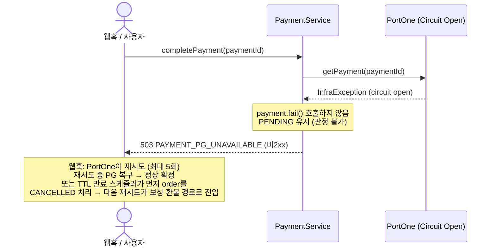

# #207 — PG 조회 실패를 결제 실패로 확정하는 버그 수정 Implementation Plan

> **For agentic workers:** REQUIRED SUB-SKILL: Use superpowers:subagent-driven-development (recommended) or superpowers:executing-plans to implement this plan task-by-task. Steps use checkbox (`- [ ]`) syntax for tracking.
>
> **구현 위임:** CLAUDE.md 규칙에 따라 실제 코드 구현은 Codex CLI에 위임한다 (`codex exec`). Claude는 계획·검증·GitHub 관리만 수행한다.

**Goal:** `completePayment`에서 PG 조회 실패(판정 불가)와 PG의 미결제 확정 응답(판정 완료)을 분리하여, 판정 불가 시 결제를 `PENDING`으로 유지하고, 웹훅 재시도가 유한하게 종료되도록 한다.

**Architecture:** 서비스 계층에서 "판정 불가"(`InfraException` / 빈 응답) 경로의 `payment.fail()` 호출을 제거해 `PENDING`을 유지한다. 컨트롤러 웹훅 핸들러는 재처리해도 결과가 달라지지 않는 터미널 결과 코드에 대해 HTTP 200을 반환해 PortOne 재시도를 멈춘다. ADR 문서의 `FAILED` 상태 의미를 실제 동작에 맞게 정정한다.

**Tech Stack:** Spring Boot 3.5, Java 25, JUnit 5 + Mockito + AssertJ, Spring MockMvc (`@WebMvcTest`)

## Global Constraints

- 베이스 패키지: `com.gongu.server`
- 소스 루트: `server/src/main/java/com/gongu/server/`, 작업 디렉터리는 워크트리 `server/.claude/worktrees/fix-207/`
- 빌드/테스트: `./gradlew` (서버 디렉터리 기준). 전체 검증은 `./gradlew test`
- 커밋 메시지 형식: `type: 작업 내용 (#207)` — **`Co-Authored-By` 절 절대 포함 금지**
- 브랜치: `fix/#207-pg-query-failure-pending` (이미 생성됨, 워크트리에서 작업)
- Surgical Changes: 요청 범위 밖 코드 수정 금지. 카운터/메트릭 이름 변경은 이번 범위 밖 (#143 모니터링 대시보드 의존)
- 비동기 결제수단(가상계좌 등) 대응은 이번 범위 밖 (이슈 "향후 고려")

---

## 배경 — 현재 코드의 문제

`PaymentService.completePayment` (`src/main/java/com/gongu/server/domain/payment/service/PaymentService.java:136-155`):

```java
PortOnePaymentResponse portOneResponse;
try {
    portOneResponse = portOneClient.getPayment(paymentId);
} catch (InfraException e) {
    payment.fail();                 // ← 판정 불가인데 FAILED 확정 (버그)
    paymentFailedPgErrorCounter.increment();
    throw e;
}

if (portOneResponse == null) {
    payment.fail();                 // ← 판정 불가인데 FAILED 확정 (버그)
    paymentFailedPgNullCounter.increment();
    throw new BusinessException(PaymentErrorCode.PAYMENT_PG_UNAVAILABLE);
}

if (!"PAID".equals(portOneResponse.status())) {
    payment.fail();                 // ← 판정 완료 (PG가 미결제라고 답함). 유지.
    paymentFailedPgStatusMismatchCounter.increment();
    throw new BusinessException(PaymentErrorCode.PAYMENT_NOT_COMPLETED);
}
```

- 메서드는 `@Transactional(noRollbackFor = {BusinessException.class, InfraException.class})` — 예외를 던져도 `payment.fail()`이 커밋된다.
- `FAILED` 확정 시 이후 요청은 `payment.getStatus() != PENDING` 가드(`:132`)에 막혀 `PAYMENT_INVALID_STATE_TRANSITION`을 던진다.
- 웹훅 핸들러(`PaymentController.receiveWebhook`, `:50-64`)는 `ORDER_EXPIRED_REFUNDED`만 200으로 처리하고 나머지 `BusinessException` / `InfraException`은 비2xx로 전파 → PortOne이 최대 5회(0·1·4·16·64·256분 backoff) 재시도하며 매번 실패.

## 결정 사항 (사용자 합의 완료)

1. **판정 불가 = `PENDING` 유지.** `InfraException` catch 블록과 `portOneResponse == null` 블록에서 `payment.fail()` 제거. 예외는 계속 던진다(재시도가 의미 있음). TTL 만료 스케줄러가 뒤처리를 보장하므로 고아가 되지 않는다.
2. **웹훅 재시도 유한 종료.** 재처리해도 결과가 동일한 터미널 코드는 200 반환. 인프라(DLQ·재시도 상한 컬럼) 추가는 하지 않음 — PortOne 자체 5회 상한 + TTL 스케줄러로 수렴, 5.7시간 초과 PG 장애라는 극단 케이스는 정산 처리에서 발견.
3. **`FAILED`는 보상 환불 분기에 포함하지 않음.** 수정 후 `FAILED`는 "PG가 미결제로 확정 응답"한 경우에만 발생 → 돈이 빠져나가지 않았으므로 환불 불필요. 현행 유지 + ADR에 근거 명시.
4. **ADR 정정.** `FAILED` "재시도 가능" 서술 수정.

## File Structure

| 파일 | 책임 | 변경 |
|---|---|---|
| `src/main/java/com/gongu/server/domain/payment/service/PaymentService.java` | 결제 확정 도메인 흐름 | `completePayment`의 판정 불가 2개 블록에서 `payment.fail()` 제거, WARN 로그 추가 |
| `src/main/java/com/gongu/server/domain/payment/controller/PaymentController.java` | 결제 HTTP 엔드포인트 + 웹훅 | `receiveWebhook`에서 터미널 코드 집합에 대해 200 반환 |
| `src/test/java/com/gongu/server/domain/payment/service/PaymentServiceTest.java` | 서비스 단위 테스트 | 판정 불가 테스트 수정/추가, 재시도 수렴 테스트 추가 |
| `src/test/java/com/gongu/server/domain/payment/controller/PaymentControllerTest.java` | 컨트롤러 슬라이스 테스트 | 웹훅 응답 코드 테스트 추가 |
| `docs/adr/결제_주문_PG_상태_전이_분석.md` | 상태 전이 기록 | `FAILED` 의미 표·다이어그램·시나리오 E 정정, `#207` 항목 추가 |

---

## Task 1: PaymentService — 판정 불가 시 `PENDING` 유지

**Files:**
- Modify: `src/main/java/com/gongu/server/domain/payment/service/PaymentService.java:136-149`
- Test: `src/test/java/com/gongu/server/domain/payment/service/PaymentServiceTest.java`

**Interfaces:**
- Consumes: 기존 `PaymentService` 생성자 시그니처(변경 없음), `PortOnePaymentResponse(String paymentId, String status, Amount amount, OffsetDateTime paidAt)`
- Produces: `completePayment(String paymentId)` 동작 변경 — `InfraException` 경로와 빈 응답 경로에서 `payment.getStatus()`는 `PENDING`으로 유지된다. 던지는 예외 타입/코드는 불변(`InfraException`, `BusinessException(PAYMENT_PG_UNAVAILABLE)`).

- [ ] **Step 1: 기존 테스트를 새 동작에 맞게 수정 (실패 상태로 만들기)**

`PaymentServiceTest.java`의 `completePayment_PortOne_InfraException` 테스트를 아래로 교체한다. `@DisplayName`도 수정한다.

```java
@Test
@DisplayName("completePayment_PG조회_InfraException_전파 — payment는 PENDING 유지 (fail 미호출)")
void completePayment_PortOne_InfraException() {
    // given
    Payment payment = Mockito.mock(Payment.class);
    given(paymentRepository.findByMerchantUidWithLock(PAYMENT_ID)).willReturn(Optional.of(payment));
    given(payment.getStatus()).willReturn(PaymentStatus.PENDING);
    given(payment.getOrder()).willReturn(order);
    given(orderRepository.findByIdWithLock(ORDER_ID)).willReturn(Optional.of(order));
    given(portOneClient.getPayment(PAYMENT_ID))
            .willThrow(new InfraException(PaymentErrorCode.PAYMENT_PG_UNAVAILABLE));

    // when & then
    assertThatThrownBy(() -> paymentService.completePayment(PAYMENT_ID))
            .isInstanceOf(InfraException.class);

    verify(payment, never()).fail();
}
```

- [ ] **Step 2: 빈 응답 경로 테스트 추가**

같은 파일, `completePayment_PortOne_InfraException` 아래에 추가:

```java
@Test
@DisplayName("completePayment_PG_빈응답 — PAYMENT_PG_UNAVAILABLE + payment는 PENDING 유지 (fail 미호출)")
void completePayment_PG_빈응답_PENDING_유지() {
    // given
    Payment payment = Mockito.mock(Payment.class);
    given(paymentRepository.findByMerchantUidWithLock(PAYMENT_ID)).willReturn(Optional.of(payment));
    given(payment.getStatus()).willReturn(PaymentStatus.PENDING);
    given(payment.getOrder()).willReturn(order);
    given(orderRepository.findByIdWithLock(ORDER_ID)).willReturn(Optional.of(order));
    given(portOneClient.getPayment(PAYMENT_ID)).willReturn(null);

    // when & then
    assertThatThrownBy(() -> paymentService.completePayment(PAYMENT_ID))
            .isInstanceOf(BusinessException.class)
            .satisfies(ex -> assertThat(((BusinessException) ex).getErrorCode())
                    .isEqualTo(PaymentErrorCode.PAYMENT_PG_UNAVAILABLE));

    verify(payment, never()).fail();
}
```

- [ ] **Step 3: 재시도 수렴 테스트 추가**

같은 파일에 추가. PG 조회가 1회차 실패 후 2회차 `PAID` 응답 → 재시도로 정상 확정에 도달함을 검증한다.

```java
@Test
@DisplayName("completePayment_조회실패후_재시도시_정상확정 — 1회차 InfraException, 2회차 PAID")
void completePayment_조회실패_재시도_정상확정() {
    // given
    Payment payment = Mockito.mock(Payment.class);
    given(paymentRepository.findByMerchantUidWithLock(PAYMENT_ID)).willReturn(Optional.of(payment));
    given(payment.getStatus()).willReturn(PaymentStatus.PENDING);
    given(payment.getOrder()).willReturn(order);
    given(payment.getMerchantUid()).willReturn(PAYMENT_ID);
    given(payment.getAmount()).willReturn(AMOUNT);
    given(payment.getPaidAt()).willReturn(LocalDateTime.now());
    given(order.getStatus()).willReturn(OrderStatus.RESERVED);
    given(orderRepository.findByIdWithLock(ORDER_ID)).willReturn(Optional.of(order));

    PortOnePaymentResponse paidResponse = new PortOnePaymentResponse(
            PAYMENT_ID, "PAID", new PortOnePaymentResponse.Amount(AMOUNT), OffsetDateTime.now());
    given(portOneClient.getPayment(PAYMENT_ID))
            .willThrow(new InfraException(PaymentErrorCode.PAYMENT_PG_UNAVAILABLE))
            .willReturn(paidResponse);

    OrderItem orderItem = Mockito.mock(OrderItem.class);
    Product orderProduct = Mockito.mock(Product.class);
    Product lockedProduct = Mockito.mock(Product.class);
    lenient().when(orderItemRepository.findAllByOrder(order)).thenReturn(List.of(orderItem));
    lenient().when(orderItem.getProduct()).thenReturn(orderProduct);
    lenient().when(orderProduct.getId()).thenReturn(1L);
    lenient().when(orderItem.getQuantity()).thenReturn(2L);
    lenient().when(productRepository.findByIdWithLock(1L)).thenReturn(Optional.of(lockedProduct));

    // when — 1회차: 예외, payment 상태 변화 없음
    assertThatThrownBy(() -> paymentService.completePayment(PAYMENT_ID))
            .isInstanceOf(InfraException.class);
    verify(payment, never()).fail();

    // when — 2회차: 정상 확정
    VerifyPaymentResponse result = paymentService.completePayment(PAYMENT_ID);

    // then
    assertThat(result).isNotNull();
    verify(order).pay();
    verify(payment).confirm(eq(AMOUNT), any(LocalDateTime.class));
}
```

- [ ] **Step 4: 테스트 실행 → 실패 확인**

Run: `./gradlew test --tests "com.gongu.server.domain.payment.service.PaymentServiceTest" -x jacocoTestCoverageVerification`
Expected: `completePayment_PortOne_InfraException`, `completePayment_PG_빈응답_PENDING_유지`, `completePayment_조회실패_재시도_정상확정` 3건 FAIL (현재 코드는 `payment.fail()` 호출).

- [ ] **Step 5: 구현 — 판정 불가 블록에서 `payment.fail()` 제거**

`PaymentService.java`의 아래 블록을 교체한다 (`:136-149`):

```java
PortOnePaymentResponse portOneResponse;
try {
    portOneResponse = portOneClient.getPayment(paymentId);
} catch (InfraException e) {
    // 판정 불가 — PG 조회 실패. 상태를 바꾸지 않고 PENDING을 유지해
    // 웹훅/사용자 재시도가 정상 확정에 도달할 수 있게 한다.
    log.warn("PortOne 조회 실패 — payment PENDING 유지, 재시도 대기: paymentId={}", paymentId, e);
    paymentFailedPgErrorCounter.increment();
    throw e;
}

if (portOneResponse == null) {
    // 판정 불가 — 빈 응답. 상태를 바꾸지 않고 PENDING 유지.
    log.warn("PortOne 빈 응답 — payment PENDING 유지, 재시도 대기: paymentId={}", paymentId);
    paymentFailedPgNullCounter.increment();
    throw new BusinessException(PaymentErrorCode.PAYMENT_PG_UNAVAILABLE);
}

if (!"PAID".equals(portOneResponse.status())) {
    // 판정 완료 — PG가 미결제/실패로 확정 응답. FAILED로 확정한다.
    payment.fail();
    paymentFailedPgStatusMismatchCounter.increment();
    throw new BusinessException(PaymentErrorCode.PAYMENT_NOT_COMPLETED);
}
```

변경점은 두 곳의 `payment.fail();` 삭제와 WARN 로그 추가뿐이다. `!"PAID"` 블록은 그대로 둔다. 카운터 호출·이름은 유지한다.

- [ ] **Step 6: 테스트 실행 → 통과 확인**

Run: `./gradlew test --tests "com.gongu.server.domain.payment.service.PaymentServiceTest" -x jacocoTestCoverageVerification`
Expected: PASS (전체 `PaymentServiceTest`)

- [ ] **Step 7: 커밋**

```bash
git add src/main/java/com/gongu/server/domain/payment/service/PaymentService.java \
        src/test/java/com/gongu/server/domain/payment/service/PaymentServiceTest.java
git commit -m "fix: PG 조회 실패 시 결제를 PENDING으로 유지 (#207)"
```

---

## Task 2: PaymentController 웹훅 — 터미널 결과에 200 반환

**Files:**
- Modify: `src/main/java/com/gongu/server/domain/payment/controller/PaymentController.java:50-64`
- Test: `src/test/java/com/gongu/server/domain/payment/controller/PaymentControllerTest.java`

**Interfaces:**
- Consumes: `PaymentErrorCode` enum(`ORDER_EXPIRED_REFUNDED`, `PAYMENT_NOT_COMPLETED`, `PAYMENT_INVALID_STATE_TRANSITION`, `PAYMENT_AMOUNT_MISMATCH`, `PAYMENT_PG_UNAVAILABLE`), `BusinessException#getErrorCode()` → `ErrorCode`
- Produces: `POST /payments/webhook` 응답 규칙 — 재처리해도 결과가 동일한 터미널 코드는 200, 재시도가 의미 있는 코드(`PAYMENT_PG_UNAVAILABLE` 등)와 `InfraException`은 비2xx 전파

- [ ] **Step 1: 웹훅 응답 코드 테스트 추가 (실패 상태)**

`PaymentControllerTest.java`, `receiveWebhook_비결제타입_200_completePayment_미호출` 아래에 추가:

```java
@Test
@DisplayName("POST /payments/webhook PG 조회 실패(PAYMENT_PG_UNAVAILABLE) → 503 (재시도 유효)")
void receiveWebhook_PG조회실패_503() throws Exception {
    given(paymentService.completePayment(anyString()))
            .willThrow(new BusinessException(PaymentErrorCode.PAYMENT_PG_UNAVAILABLE));

    String webhookBody = "{\"type\":\"Transaction.Paid\",\"data\":{\"paymentId\":\"pay-uuid-001\"}}";

    mockMvc.perform(post("/payments/webhook")
                    .contentType(MediaType.APPLICATION_JSON)
                    .content(webhookBody))
            .andExpect(status().isServiceUnavailable());
}

@Test
@DisplayName("POST /payments/webhook PG 미결제 확정(PAYMENT_NOT_COMPLETED) → 200 (재시도 중단)")
void receiveWebhook_PG미결제확정_200() throws Exception {
    given(paymentService.completePayment(anyString()))
            .willThrow(new BusinessException(PaymentErrorCode.PAYMENT_NOT_COMPLETED));

    String webhookBody = "{\"type\":\"Transaction.Paid\",\"data\":{\"paymentId\":\"pay-uuid-001\"}}";

    mockMvc.perform(post("/payments/webhook")
                    .contentType(MediaType.APPLICATION_JSON)
                    .content(webhookBody))
            .andExpect(status().isOk());
}

@Test
@DisplayName("POST /payments/webhook 이미 터미널 상태(PAYMENT_INVALID_STATE_TRANSITION) → 200 (재시도 중단)")
void receiveWebhook_이미터미널_200() throws Exception {
    given(paymentService.completePayment(anyString()))
            .willThrow(new BusinessException(PaymentErrorCode.PAYMENT_INVALID_STATE_TRANSITION));

    String webhookBody = "{\"type\":\"Transaction.Paid\",\"data\":{\"paymentId\":\"pay-uuid-001\"}}";

    mockMvc.perform(post("/payments/webhook")
                    .contentType(MediaType.APPLICATION_JSON)
                    .content(webhookBody))
            .andExpect(status().isOk());
}

@Test
@DisplayName("POST /payments/webhook 금액 불일치(PAYMENT_AMOUNT_MISMATCH) → 200 (보상 완료, 재시도 중단)")
void receiveWebhook_금액불일치_200() throws Exception {
    given(paymentService.completePayment(anyString()))
            .willThrow(new BusinessException(PaymentErrorCode.PAYMENT_AMOUNT_MISMATCH));

    String webhookBody = "{\"type\":\"Transaction.Paid\",\"data\":{\"paymentId\":\"pay-uuid-001\"}}";

    mockMvc.perform(post("/payments/webhook")
                    .contentType(MediaType.APPLICATION_JSON)
                    .content(webhookBody))
            .andExpect(status().isOk());
}
```

- [ ] **Step 2: 테스트 실행 → 실패 확인**

Run: `./gradlew test --tests "com.gongu.server.domain.payment.controller.PaymentControllerTest" -x jacocoTestCoverageVerification`
Expected: `receiveWebhook_PG미결제확정_200`, `receiveWebhook_이미터미널_200`, `receiveWebhook_금액불일치_200` FAIL (현재는 비2xx 전파). `receiveWebhook_PG조회실패_503`은 PASS(현재도 전파됨) — 회귀 방지용.

- [ ] **Step 3: 구현 — 터미널 코드 집합에 200 반환**

`PaymentController.java`를 수정한다.

임포트 추가:
```java
import com.gongu.server.global.exception.ErrorCode;
import com.gongu.server.global.exception.errorcode.PaymentErrorCode;
import java.util.Set;
```
(`PaymentErrorCode`는 이미 임포트되어 있으면 중복 추가하지 않는다.)

클래스 상단에 상수 추가:
```java
/**
 * 재처리해도 결과가 달라지지 않는 터미널/이미처리 결과 코드.
 * PortOne 웹훅 재시도를 멈추기 위해 200을 반환한다.
 */
private static final Set<ErrorCode> WEBHOOK_TERMINAL_CODES = Set.of(
        PaymentErrorCode.ORDER_EXPIRED_REFUNDED,
        PaymentErrorCode.PAYMENT_NOT_COMPLETED,
        PaymentErrorCode.PAYMENT_INVALID_STATE_TRANSITION,
        PaymentErrorCode.PAYMENT_AMOUNT_MISMATCH
);
```

`receiveWebhook` 메서드의 catch 블록을 교체:
```java
@PostMapping("/webhook")
public ResponseEntity<Void> receiveWebhook(@Valid @RequestBody PortOneWebhookPayload payload) {
    if ("Transaction.Paid".equals(payload.type())) {
        try {
            paymentService.completePayment(payload.data().paymentId());
        } catch (BusinessException e) {
            if (WEBHOOK_TERMINAL_CODES.contains(e.getErrorCode())) {
                // 재처리해도 결과가 동일한 확정 상태 — PortOne 재시도를 멈추기 위해 200 반환
                return ResponseEntity.ok().build();
            }
            // 판정 불가(PAYMENT_PG_UNAVAILABLE) 등 — 재시도가 의미 있으므로 비2xx 전파
            throw e;
        }
    }
    return ResponseEntity.ok().build();
}
```

- [ ] **Step 4: 테스트 실행 → 통과 확인**

Run: `./gradlew test --tests "com.gongu.server.domain.payment.controller.PaymentControllerTest" -x jacocoTestCoverageVerification`
Expected: PASS (전체 `PaymentControllerTest`)

- [ ] **Step 5: 커밋**

```bash
git add src/main/java/com/gongu/server/domain/payment/controller/PaymentController.java \
        src/test/java/com/gongu/server/domain/payment/controller/PaymentControllerTest.java
git commit -m "fix: 웹훅 터미널 결과에 200 반환하여 재시도 유한 종료 (#207)"
```

---

## Task 3: ADR 정정 — `결제_주문_PG_상태_전이_분석.md`

**Files:**
- Modify: `docs/adr/결제_주문_PG_상태_전이_분석.md`

**Interfaces:** 문서 전용. 코드 의존 없음.

- [ ] **Step 1: Payment 상태 전이 다이어그램 라벨 수정**

섹션 1의 mermaid `stateDiagram-v2`에서:
```
    PENDING --> FAILED    : fail()\n(PG 조회 실패 / 미결제)
```
를 아래로 변경:
```
    PENDING --> FAILED    : fail()\n(PG가 미결제/실패로 확정 응답)
```

- [ ] **Step 2: 상태 의미 표 수정**

섹션 1 "**상태 의미**" 표의 `FAILED` 행:
```
| `FAILED` | PG 조회 실패 또는 미결제 상태 (재시도 가능) |
```
를 아래로 변경:
```
| `FAILED` | PG가 미결제/실패로 **확정 응답**한 상태. 터미널 — 재시도 불가. 돈이 빠져나가지 않았으므로 보상 환불 대상 아님 (#207) |
```

- [ ] **Step 3: 시나리오 E 재작성**

섹션 2 "### 시나리오 E — PG 장애 (Circuit Breaker)" 전체를 아래로 교체:

````markdown
### 시나리오 E — PG 장애 (Circuit Breaker) — #207 수정 반영



> **판정 불가 vs 판정 완료**
> - 조회 실패(`InfraException`)·빈 응답 → **판정 불가**. `PENDING` 유지, 비2xx로 재시도 유도.
> - PG가 `PAID`가 아니라고 확정 응답 → **판정 완료**. `payment.fail()` → `FAILED`. 웹훅 핸들러는 `PAYMENT_NOT_COMPLETED`를 터미널로 보고 200 반환하여 재시도를 멈춘다.
>
> **cancelPayment의 circuit open**은 다르다.
> `cancelPaymentFallback`이 `InfraException`을 throw → `executePGCancel`에서 catch되지 않음 → 전파 → 트랜잭션 롤백 → payment 상태 변경 없음.
````

- [ ] **Step 4: 섹션 3에 #207 수정 항목 추가**

섹션 3 "## 3. 구현 중 놓쳐서 추가한 로직"의 마지막 하위 항목((6) 아래)에 추가:

````markdown
---

### (7) PG 조회 실패를 결제 실패로 확정 (#207)

**증상**: `completePayment`가 PG 조회 실패(`InfraException`)·빈 응답 시에도 `payment.fail()`을 호출해 `FAILED`로 확정했다. 이 시점의 결제는 PG에서 이미 승인이 끝난 상태이므로, `FAILED` 확정은 "확인을 못 했을 뿐"인데 실패로 단정한 것이다. 이후 재시도는 `payment.status != PENDING` 가드에 막혀 영원히 성공하지 못하고, 웹훅은 비2xx를 반복 반환했다.

**원인**: 성격이 다른 세 상황(PG가 실패라고 확정 응답 / 조회 실패 / 빈 응답)을 모두 `payment.fail()`로 동일 처리. `@Transactional(noRollbackFor=...)` 때문에 예외를 던져도 `FAILED`가 커밋됨.

**수정**:
- `InfraException` catch 블록과 `portOneResponse == null` 블록에서 `payment.fail()` 제거 → `PENDING` 유지. 재시도/스케줄러가 정상 경로로 수렴.
- 웹훅 핸들러: 재처리해도 결과가 동일한 터미널 코드(`ORDER_EXPIRED_REFUNDED`, `PAYMENT_NOT_COMPLETED`, `PAYMENT_INVALID_STATE_TRANSITION`, `PAYMENT_AMOUNT_MISMATCH`)에 200 반환 → PortOne 재시도 유한 종료. 판정 불가(`PAYMENT_PG_UNAVAILABLE`)는 비2xx 유지.
- `FAILED`는 수정 후 "PG 미결제 확정"에서만 발생 → 보상 환불 분기(허용 상태 `PENDING`·`CANCELLED`)에 포함하지 않음.

**남은 한계**: PG가 PortOne 재시도 상한(~5.7시간)을 넘겨 장애이고 그 사이 TTL 스케줄러도 지나간 경우, order는 `CANCELLED`인데 PG 결제는 살아있는 고아가 될 수 있다. 정산 처리에서 발견하는 것으로 수용. 비동기 결제수단 추가 시 재검토.
````

- [ ] **Step 5: 문서 정합성 확인**

Run: `grep -n "재시도 가능\|FAILED" "docs/adr/결제_주문_PG_상태_전이_분석.md"`
Expected: `FAILED`에 "재시도 가능" 서술이 남아있지 않음. 시나리오 E 각주와 상태 의미 표가 일치.

- [ ] **Step 6: 커밋**

```bash
git add "docs/adr/결제_주문_PG_상태_전이_분석.md"
git commit -m "docs: FAILED 상태 의미를 실제 동작에 맞게 정정 (#207)"
```

---

## Task 4: 전체 빌드·테스트 검증

**Files:** 없음 (검증 전용)

- [ ] **Step 1: 전체 테스트 실행**

Run: `./gradlew test`
Expected: BUILD SUCCESSFUL. jacoco 커버리지 검증 포함 통과 (payment 도메인 커버리지가 떨어지지 않아야 함 — 테스트를 추가만 했으므로 유지/상승).

- [ ] **Step 2: 실패 시 Codex에 수정 재위임**

빌드/테스트 실패 시 로그를 첨부해 Codex에 수정 위임. jacoco 커버리지 실패라면 원인 파악 후 대응.

---

## Self-Review

**Spec coverage (이슈 #207 완료 기준):**

| 완료 기준 | 대응 |
|---|---|
| 조회 실패 시 `PENDING` 유지 + 재시도로 정상 확정 도달 검증 테스트 | Task 1 Step 3 (`completePayment_조회실패_재시도_정상확정`) |
| 웹훅 재시도가 유한하게 종료되거나 추적 가능한 형태로 남는지 확인 | Task 2 — 터미널 코드 200 반환 + PortOne 자체 5회 상한. WARN 로그로 추적(Task 1 Step 5) |
| `FAILED` 보상 환불 허용 여부 결정 및 반영 | 결정: 미포함(현행 유지). ADR에 근거 명시 (Task 3 Step 2, Step 4) |
| ADR 상태 의미 표 정정 | Task 3 Step 2 |

**수정 범위 항목 매핑:**
- 이슈 "1. 판정 불가와 판정 완료를 분리" → Task 1
- 이슈 "2. 웹훅 응답 코드 재검토" → Task 2 (DLQ/재시도 상한 컬럼은 사용자 합의로 미도입)
- 이슈 "3. `FAILED`의 보상 환불 허용 여부 결정" → 미포함 결정 + ADR 반영
- 이슈 "4. ADR 정정" → Task 3

**Placeholder scan:** 모든 코드 스텝에 실제 코드 블록 포함. TODO/TBD 없음.

**Type consistency:** `WEBHOOK_TERMINAL_CODES`는 `Set<ErrorCode>`, `BusinessException#getErrorCode()` 반환 타입 `ErrorCode`와 일치. `PortOnePaymentResponse` 생성자 인자 순서는 기존 테스트(`completePayment_성공_금액일치`)와 동일.

**범위 밖(명시):** 카운터/메트릭 이름 변경, DLQ 테이블, 재시도 상한 컬럼, 비동기 결제수단(가상계좌) 대응, `PAYMENT_NOT_FOUND` 웹훅 응답 코드.
